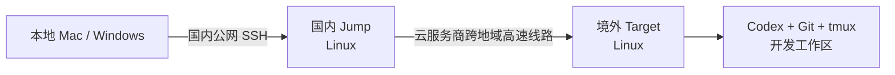

# codex-vpc-bridge — Agent Deployment Runbook

> 目标读者：Codex、Claude Code 等能够读取仓库、执行本地命令并通过 SSH 操作远程主机的 Agent。
>
> 这不是面向人类逐步照抄的教程。Agent 接到部署任务后，应读取本文，收集必要输入，调用仓库内
> 安装脚本，完成验证，并向用户报告结果。

## 1. Agent 的目标

将用户的远程 Codex 开发链路配置为：



部署完成后必须达到以下结果：

1. 本地 `ssh jump` 登录国内跳板机。
2. 本地 `ssh target` 自动使用 `ProxyJump jump` 登录境外开发机。
3. jump 上的 `ssh target` 通过私网地址登录境外开发机。
4. 本地与 jump 均提供 `l`、`a`、`k`、`n` 四个 tmux 快捷命令。
5. target 上已经安装 `tmux` 和 Codex CLI，并且能输出各自版本。
6. 本地私钥不复制到 jump；jump 默认通过 SSH agent forwarding 使用本地密钥。
7. 重复执行安装脚本不会重复追加配置，也不会删除托管标记之外的用户配置。

## 2. 设计意图

### 2.1 为什么使用国内 jump

境外 target 负责运行 Codex 和代码，但本地直连境外公网可能出现高延迟、丢包和链路波动。
国内 jump 缩短本地公网路径，再通过云服务商跨地域私网、高速通道或云企业网络连接 target。

本项目不创建云服务器、VPC、跨地域网络、路由或安全组。Agent 只能验证这些前置条件；除非用户
另外明确授权，否则不得修改云网络或服务器 sshd 配置。

### 2.2 为什么使用 tmux

高速线路改善连接质量，但 SSH 仍可能因为本地网络切换、电脑休眠、临时丢包或超时而中断。
Codex 任务可能长时间运行；如果直接依附普通 SSH shell，断线后进程和终端现场通常也会丢失。

tmux 必须运行在 target 上，用来把 Codex 进程与当前 SSH 连接分离：

- SSH 断开时，Codex、工作目录和终端输出继续保留。
- 重新连接后，执行 `l` 查看会话，执行 `a 1` 回到原 Codex 现场。
- 不同项目可以使用不同会话，例如 `n api-dev`、`n frontend-dev`。
- local 与 jump 只作为连接入口，不承载实际开发进程。

Agent 不得把 tmux 描述为网络加速工具。高速线路负责连接质量，tmux 负责断线后的任务连续性。

## 3. 必要输入

Agent 开始执行前必须获得或可靠发现以下值：

| 变量 | 是否必需 | 示例 | 说明 |
|---|---:|---|---|
| `CLIENT_OS` | 是 | `macos` / `windows` | Agent 应优先自动识别 |
| `JUMP` | 是 | `ubuntu@jump.example.com` | 国内 jump 的 `user@host` |
| `TARGET` | 是 | `ubuntu@10.0.1.10` | jump 可访问的 target 私网地址 |
| `IDENTITY_FILE` | 是 | `~/.ssh/id_rsa` | 本地私钥路径 |
| `JUMP_PROFILE` | 否 | `~/.bashrc` | 不提供时由 Linux 脚本按 `$SHELL` 判断 |
| `CODEX_METHOD` | 否 | `standalone` / `npm` | 默认使用官方 standalone 安装器 |

规则：

- 缺少必需值时，只询问缺失值，不要让用户重复提供已有信息。
- 不要要求用户发送私钥内容。只接收本地文件路径。
- 不要把真实主机地址、用户名、私钥路径或云凭据写回本仓库。
- 如果用户明确给出不同的 SSH alias 需求，先说明当前脚本固定使用 `jump` 和 `target`，不要静默改义。

## 4. 执行边界

Agent 必须遵守以下约束：

1. 执行安装前，先读取本文件及目标平台脚本。
2. 优先运行现有脚本，不要手工拼接等价配置。
3. 只修改脚本声明的托管配置块。
4. 不复制、读取或输出私钥内容。
5. 仅对用户明确指定且可信任的 jump 启用 agent forwarding。
6. 不自动修改 `PasswordAuthentication`、`PermitRootLogin`、`LoginGraceTime` 或防火墙。
7. 不自动创建或删除用户已有的 tmux 会话。
8. target 脚本只允许安装 `tmux`、`curl`、CA certificates 和 Codex CLI；不要借机安装其他开发环境。
9. Codex 登录涉及用户账号或 API key，Agent 不得读取或回显认证凭据。
10. SSH、路由或鉴权失败时，先做只读诊断；需要扩展权限或改变云资源时停止并报告。

## 5. 仓库内的执行入口

| 平台 | 脚本 | 写入位置 |
|---|---|---|
| Mac 客户端 | `scripts/install-client-macos.sh` | `~/.ssh/config`、`~/.zshrc` |
| Windows 客户端 | `scripts/install-client-windows.ps1` | `%USERPROFILE%\.ssh\config`、PowerShell Profile |
| Linux jump | `scripts/install-jump-linux.sh` | `~/.ssh/config`、`~/.bashrc` 或 `~/.zshrc` |
| Linux target | `scripts/install-target-linux.sh` | 系统包、当前用户的 Codex CLI |

客户端和 jump 脚本使用 `codex-vpc-bridge` 标记管理配置块。target 脚本按当前状态补齐或更新软件。
所有脚本都必须可重复执行。

## 6. 标准执行流程

### Phase A：本地预检

Agent 应执行等价检查：

```bash
test -f "$IDENTITY_FILE"
ssh -V
```

检查目标：

- 私钥文件存在。
- OpenSSH Client 可用。
- 工作区是本仓库，目标脚本存在。
- 本地现有 `~/.ssh/config` 和 shell Profile 可读。

如果需要确认公网入口，只测试 `JUMP`；target 的私网地址不要求本地直连。

### Phase B：安装本地客户端

#### Mac

Agent 使用：

```bash
chmod +x scripts/install-client-macos.sh

./scripts/install-client-macos.sh \
  --jump "$JUMP" \
  --target "$TARGET" \
  --identity "$IDENTITY_FILE"
```

安装后，Agent 不应依赖当前非交互 shell 自动加载 `.zshrc`，而应使用新的 zsh 进程验证：

```bash
zsh -ic 'type l; type a; type k; type n'
```

#### Windows

Agent 在 PowerShell 中使用：

```powershell
powershell -ExecutionPolicy Bypass -File .\scripts\install-client-windows.ps1 `
  -Jump $Jump `
  -Target $Target `
  -IdentityFile $IdentityFile
```

安装后应启动新的 PowerShell 进程或显式加载脚本输出的 Profile，再验证四个函数存在。

### Phase C：准备 SSH agent

为了让 jump 上的命令使用本地私钥，Agent 应先检查：

```bash
ssh-add -l
```

如果目标密钥尚未加载，再执行：

```bash
ssh-add "$IDENTITY_FILE"
```

如果 `ssh-agent` 未运行，Agent 可以在当前用户会话内启动或提示用户启动。不要因此复制私钥到 jump。

### Phase D：在 jump 上安装

从本地复制 Linux 脚本：

```bash
scp scripts/install-jump-linux.sh jump:~/install-jump-linux.sh
```

在 jump 上执行：

```bash
ssh jump "chmod +x ~/install-jump-linux.sh && \
  ~/install-jump-linux.sh --target '$TARGET'"
```

`TARGET` 是 `user@private-host`。如果用户明确要求 jump 使用 jump 自己已有的专用密钥，可以改用：

```bash
ssh jump "~/install-jump-linux.sh \
  --target '$TARGET' \
  --identity '~/.ssh/id_rsa'"
```

Agent 不得主动上传本地私钥。

### Phase E：准备 target 开发环境

target 发行版可能是 Ubuntu、Debian、CentOS、Rocky Linux、AlmaLinux、Fedora、SUSE、Alpine、
Arch Linux 或其他 Linux。不要为每个发行版维护一套脚本；先运行统一的 POSIX `sh` 安装器：

```bash
scp scripts/install-target-linux.sh target:~/install-target-linux.sh
ssh -t target 'chmod +x ~/install-target-linux.sh && sh ~/install-target-linux.sh'
```

脚本会：

- 检测 apt、dnf、yum、zypper、apk 或 pacman。
- 通过 sudo 安装缺失的 `tmux`、`curl` 和 CA certificates。
- 以当前非 root 用户运行 OpenAI 官方 standalone 安装器。
- 验证 `tmux -V`、`codex --version` 和 Codex 登录状态。

识别包管理器只代表脚本知道怎样安装基础依赖，不代表 OpenAI 官方承诺支持该发行版。最终必须以
`codex --version` 在 target 上真实运行成功为准；如果二进制与系统 libc、架构或内核不兼容，
Agent 应报告具体兼容性边界，不得改用来源不明的第三方 Codex 包。

官方当前推荐的 macOS/Linux 安装方式是
[`curl -fsSL https://chatgpt.com/codex/install.sh | sh`](https://developers.openai.com/codex/cli)。
仓库脚本先把安装器下载到临时文件，确认下载成功后再执行，避免管道前半段下载失败却被误判为成功。

如果发行版的包管理器无法识别，Agent 应读取 `/etc/os-release`，用系统原生方式安装 `tmux`、
`curl` 和 CA certificates，然后重新执行：

```bash
ssh -t target 'sh ~/install-target-linux.sh --skip-system-packages'
```

如果 target 无法访问 `chatgpt.com`，但已经有可用的 Node.js 和 npm，可以使用 OpenAI 官方
支持的 npm 安装方式：

```bash
ssh -t target 'sh ~/install-target-linux.sh --codex-method npm'
```

不要用 `sudo npm install -g`。npm 全局目录权限错误应由 Agent 修复当前用户的 npm prefix，
或者恢复使用 standalone 安装方式。

target 是远程无桌面环境。Codex 未登录时，优先让用户在交互 SSH/tmux 中执行：

```bash
codex login --device-auth
```

设备码登录需要用户在浏览器完成确认，Agent 不得代替用户处理账号凭据。官方还支持 ChatGPT 登录
和 API key 登录；认证方式以 [Codex Authentication](https://developers.openai.com/codex/auth)
为准。

### Phase F：端到端验证

本地 SSH 配置解析：

```bash
ssh -G jump
ssh -G target
```

Agent 至少确认：

- `jump` 的 hostname 和 user 与输入一致。
- `jump` 的 `forwardagent` 为 `yes`。
- `target` 的 hostname 和 user 与输入一致。
- `target` 的 `proxyjump` 为 `jump`。
- 两个 Host 均解析到预期的本地 identity file。

连接验证：

```bash
ssh jump hostname
ssh target hostname
ssh jump 'ssh target hostname'
ssh target 'tmux -V'
ssh target 'codex --version'
ssh target 'codex login status'
```

快捷命令加载验证：

```bash
zsh -ic 'type l; type a; type k; type n'      # Mac
ssh jump 'bash -ic "type l; type a; type k; type n"'
```

如果 jump 使用 zsh，应把最后一条改为 `zsh -ic`。验证阶段不要创建或删除真实 tmux 会话。

## 7. 快捷命令契约

| 命令 | 参数 | 必须行为 |
|---|---|---|
| `l` | 无 | 输出 target 上的 tmux 会话，并从 1 开始编号 |
| `a N` | 正整数序号 | 进入 `l` 中第 N 个会话 |
| `k N` | 正整数序号 | 显示最终会话名并确认；确认后关闭会话，再次输出 `l` |
| `n NAME` | 会话名 | 创建并进入新会话 |

`NAME` 仅允许字母、数字、下划线和连字符。`a`、`k` 使用序号，不直接接收会话名。

`k N` 在真正删除前必须显示本次查询最终解析出的会话名：

```text
Kill tmux session 'pop-dev1'? [Y/n]
```

直接回车、输入 `y` 或 `yes` 执行删除；其他输入取消。读取不到交互输入时必须取消，不能把 EOF
当作默认确认。确认成功并删除后，`k` 才能再次执行 `l`。

Agent 向用户解释 tmux 内操作时使用：

- 保留会话并离开：`Ctrl-b`，松开后按 `d`。
- 退出并关闭当前会话：在会话 shell 中执行 `exit`。

## 8. 成功标准

只有同时满足以下条件，Agent 才能报告部署完成：

- 客户端安装脚本成功退出。
- jump 安装脚本成功退出。
- target 安装脚本成功退出。
- `ssh -G` 解析结果符合输入。
- 本地可以执行只读命令到 jump 和 target。
- jump 可以执行只读命令到 target。
- target 上的 `tmux -V` 和 `codex --version` 成功。
- `codex login status` 已确认认证完成，或明确向用户报告“安装完成、认证待用户操作”。
- 本地和 jump 均能加载 `l`、`a`、`k`、`n`。
- 托管配置标记各只有一组。
- 未把私钥或其他 secret 复制到 jump、写入仓库或输出到回复。

如果仅完成部分条件，必须明确报告“部分完成”，不能把脚本写入成功等同于端到端可用。

## 9. 故障归因

### 本地无法连接 jump

检查本地 DNS、公网 TCP 22、jump 安全组、本地 identity file 和 jump 的 `authorized_keys`。

### 本地 `ssh target` 超时

先执行 `ssh jump hostname`：

- jump 也失败：问题在 local → jump。
- jump 成功：再从 jump 测试 target TCP 22，问题通常在跨地域路由、安全组、ACL 或 target sshd。

### jump 上 `ssh target` 返回 `Permission denied (publickey)`

依次检查：

```bash
ssh-add -l
ssh jump 'test -n "$SSH_AUTH_SOCK" && ssh-add -l'
```

本地有密钥但 jump 没有 `$SSH_AUTH_SOCK`，说明 agent 未转发；检查 `ForwardAgent yes` 或使用
`ssh -A jump`。jump 能看到密钥但 target 拒绝，检查 target 的 `authorized_keys` 和目标用户。

### `l` 返回 `no server running` 或 `no sessions`

这表示 target 当前没有 tmux 会话，不代表 SSH 或安装失败。除非用户要求，否则 Agent 不要为了
验证而创建一个长期存在的会话。

### 安装后当前终端找不到命令

Profile 写入不会自动改变已经启动的父 shell。使用新的交互 shell 进行验证，不要重复安装来碰运气。

### target 包管理器不受支持

读取 `/etc/os-release` 和发行版文档，只安装 `tmux`、`curl` 与 CA certificates。确认命令存在后，
使用 `--skip-system-packages` 继续。不要为了覆盖一个小众发行版不断扩大脚本中的发行版特例。

### Codex standalone 安装器无法下载

先验证 target 是否能访问 `https://chatgpt.com/codex/install.sh`。如果只是该域名受限且系统已有
Node.js/npm，可以改用 `--codex-method npm`；否则报告 target 出口网络问题，不要使用非官方镜像。

### Codex 已安装但未登录

这不是安装失败。远程无桌面环境优先使用 `codex login --device-auth`，并让用户完成浏览器确认。
Agent 可以用 `codex login status` 验证结果，但不得读取或展示 `~/.codex/auth.json`。

## 10. Agent 最终报告格式

完成部署后，用简短、可验证的格式回复：

```text
结果：完成 / 部分完成 / 未完成
客户端：<OS 与写入的 Profile>
链路：local -> jump -> target
Target：<发行版、tmux 版本、Codex 版本、认证状态>
验证：<已通过的 SSH 与命令检查>
未修改：<云网络、sshd、私钥等>
问题：<无，或具体失败点与下一步>
```

不要在最终报告中输出私钥内容、密钥指纹以外的敏感认证数据或不必要的服务器配置。
