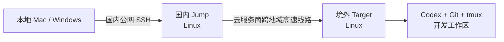

# codex-vpc-bridge

通过国内 Linux 跳板机和云服务商跨地域高速网络，稳定连接境外 Codex 开发机，减少本地 VPN
带来的卡顿、掉线和不可用问题。

## 为什么需要它

将 Codex CLI、代码仓库和长期运行的开发会话放在境外服务器，可以直接访问境外开发服务；
但本地直接连接境外服务器时，公网链路容易受到高延迟、丢包和网络波动影响。

本项目把访问链路拆成两段：

1. 本地 Mac/Windows 通过国内公网连接国内跳板机。
2. 国内跳板机通过云服务商的跨地域私网或高速网络连接境外开发机。



安装完成后：

- 本地执行 `ssh target`，OpenSSH 会自动通过 `jump` 登录境外开发机。
- 本地和 jump 上都可以使用 `l`、`a`、`k`、`n` 管理 target 上的 tmux 会话。
- 私钥保留在本地，通过 SSH agent forwarding 给受信任的 jump 使用，不需要复制到 jump。

> 本项目不负责创建云服务器或跨地域网络。安装前需要先打通 jump 到 target 私网地址的路由。

## 为什么使用 tmux

跳板机和高速线路能改善 SSH 的连接质量，但任何远程连接仍可能因为本地网络切换、电脑休眠、
临时丢包或 SSH 超时而中断。Codex 经常需要持续运行较长时间；如果直接在普通 SSH shell
中启动，连接断开后 shell 和正在执行的任务通常也会随之终止，尚未完成的上下文和终端现场很难恢复。

tmux 运行在境外 target 上，将“Codex 进程”与“当前 SSH 连接”分离：

- SSH 断开时，Codex、命令输出和工作目录继续保留在 target 上。
- 重新联网后执行 `l` 查看会话，再执行 `a 1` 即可回到原来的 Codex 现场。
- 可以为不同项目创建独立会话，例如 `n api-dev`、`n frontend-dev`。
- 本地和 jump 只是连接入口，不需要在两边分别维护开发进程。

tmux 本身不会降低网络延迟，也不能代替稳定的跨地域线路；它解决的是连接偶尔中断时，开发任务
不丢失、工作可以快速续接的问题。两者配合后，高速线路负责改善连接质量，tmux 负责保证开发会话连续。

## 项目结构

```text
codex-vpc-bridge/
├── README.md
└── scripts/
    ├── install-client-macos.sh
    ├── install-client-windows.ps1
    └── install-jump-linux.sh
```

## 部署前提

### 云网络

- jump 是国内 Linux 服务器，有本地可访问的公网地址。
- target 是境外 Linux 服务器，运行 Codex、Git 和 tmux。
- jump 与 target 之间已经通过云服务商的跨地域私网、高速通道或云企业网络互通。
- jump 能通过 target 私网地址访问 TCP 22，例如 `10.0.1.10:22`。
- target 的安全组应优先只允许 jump 所在私网或安全组访问 SSH，不必暴露公网 SSH。

跨境网络服务的开通方式和合规要求因云服务商及地区而异，请以实际供应商要求为准。

### SSH 与软件

- 本地已安装 OpenSSH Client。
- jump 和 target 已安装并启用 OpenSSH Server。
- target 已安装 `tmux`。
- 本地公钥已经写入 jump 和 target 用户的 `~/.ssh/authorized_keys`。
- 示例使用同一把本地私钥登录两台服务器。

建议两台服务器关闭密码登录和 root 远程登录：

```text
PasswordAuthentication no
PermitRootLogin no
LoginGraceTime 3
```

修改 sshd 配置前应保留一个已登录会话，并先用 `sshd -t` 检查配置，避免把自己锁在服务器外。

## 安装

以下示例使用：

```text
jump:   ubuntu@jump.example.com
target: ubuntu@10.0.1.10
key:    ~/.ssh/id_rsa
```

### 1. Mac 客户端

```bash
chmod +x scripts/install-client-macos.sh

./scripts/install-client-macos.sh \
  --jump ubuntu@jump.example.com \
  --target ubuntu@10.0.1.10 \
  --identity ~/.ssh/id_rsa

source ~/.zshrc
```

脚本会写入：

- `~/.ssh/config`：创建 `jump`、`target`，并为 target 配置 `ProxyJump jump`。
- `~/.zshrc`：安装 `l`、`a`、`k`、`n`。

### 2. Windows 客户端

在 PowerShell 中执行：

```powershell
powershell -ExecutionPolicy Bypass -File .\scripts\install-client-windows.ps1 `
  -Jump ubuntu@jump.example.com `
  -Target ubuntu@10.0.1.10 `
  -IdentityFile "$HOME\.ssh\id_rsa"
```

安装完成后重新打开 PowerShell，或者按照脚本输出重新加载 PowerShell Profile。

### 3. 把本地密钥加入 SSH agent

jump 上的快捷命令需要使用转发过来的本地 SSH agent：

```bash
ssh-add ~/.ssh/id_rsa
ssh-add -l
```

Windows 同样使用 OpenSSH 的 `ssh-agent` 和 `ssh-add`。客户端安装脚本只对 `Host jump`
启用 `ForwardAgent yes`，不会复制私钥文件。

### 4. 在 jump 上安装

先从本地复制脚本：

```bash
scp scripts/install-jump-linux.sh jump:~/
ssh jump
```

然后在 jump 上执行：

```bash
chmod +x ~/install-jump-linux.sh

~/install-jump-linux.sh \
  --target ubuntu@10.0.1.10
```

脚本会自动选择 `~/.bashrc` 或 `~/.zshrc`，并输出对应的重新加载命令。常见情况是：

```bash
source ~/.bashrc
```

如果 jump 自己已经保存了专用私钥，也可以不用 agent forwarding：

```bash
~/install-jump-linux.sh \
  --target ubuntu@10.0.1.10 \
  --identity ~/.ssh/id_rsa
```

不建议把本地私人密钥复制到 jump。

## 使用

### SSH 主机别名

```bash
ssh jump
ssh target
```

在本地执行 `ssh target` 时，连接路径是：

```text
local -> jump -> target
```

在 jump 上执行 `ssh target` 时，使用的是 target 私网地址。

### tmux 快捷命令

这些命令在本地和 jump 上行为一致：

| 命令 | 作用 |
|---|---|
| `l` | 列出 target 上的 tmux 会话，并显示序号 |
| `a 1` | 按 `l` 显示的序号进入会话 |
| `k 1` | 按序号关闭会话，成功后自动再次执行 `l` |
| `n pop-dev1` | 创建并进入名为 `pop-dev1` 的新会话 |

进入 tmux 会话后：

- 暂时离开但保留会话：按 `Ctrl-b`，松开后按 `d`。
- 退出并关闭当前会话：在会话里的 shell 执行 `exit`。

## 验证

在本地检查：

```bash
ssh -G jump | grep -E '^(hostname|user|forwardagent) '
ssh -G target | grep -E '^(hostname|user|proxyjump) '
ssh target hostname
l
```

在 jump 上检查：

```bash
test -n "$SSH_AUTH_SOCK" && echo "SSH agent forwarded"
ssh-add -l
ssh target hostname
l
```

## 常见问题

### 本地能登录 jump，但不能登录 target

先在 jump 上检查私网连通性：

```bash
ssh target
```

如果连接超时，重点检查跨地域路由、target 安全组、网络 ACL 和 target 的 sshd。

### jump 上提示 `Permission denied (publickey)`

检查本地密钥是否已加入 agent：

```bash
ssh-add -l
```

再检查 jump 会话是否收到 agent：

```bash
echo "$SSH_AUTH_SOCK"
ssh-add -l
```

如果没有，重新从本地执行 `ssh -A jump`，或者重新运行客户端安装脚本。

### `l` 提示没有 tmux server

这表示 target 当前没有 tmux 会话。执行下面的命令创建一个：

```bash
n pop-dev1
```

### 安装后找不到快捷命令

重新打开终端，或加载脚本输出的 Profile：

```bash
source ~/.zshrc
# 或
source ~/.bashrc
```

## 配置更新原则

三个安装脚本都使用带标记的托管配置块：

- 重复执行会替换旧配置，不会无限追加。
- 标记之外的现有 SSH 配置和 shell 配置会保留。
- 更换 jump、target 或私钥时，重新运行对应脚本即可。

## 安全边界

- 仅对可信任的 jump 启用 SSH agent forwarding。
- agent forwarding 不会把私钥文件复制到 jump，但 jump 上的高权限进程可能在会话期间借用
  agent 完成签名，因此不要把 agent 转发到不受信任的服务器。
- target 优先使用私网地址，并限制 SSH 来源。
- 私钥、云凭据和真实服务器清单不要提交到 Git 仓库。
- 本项目只管理客户端 SSH 别名和 tmux 快捷命令，不会自动修改服务器 sshd 或云网络。
